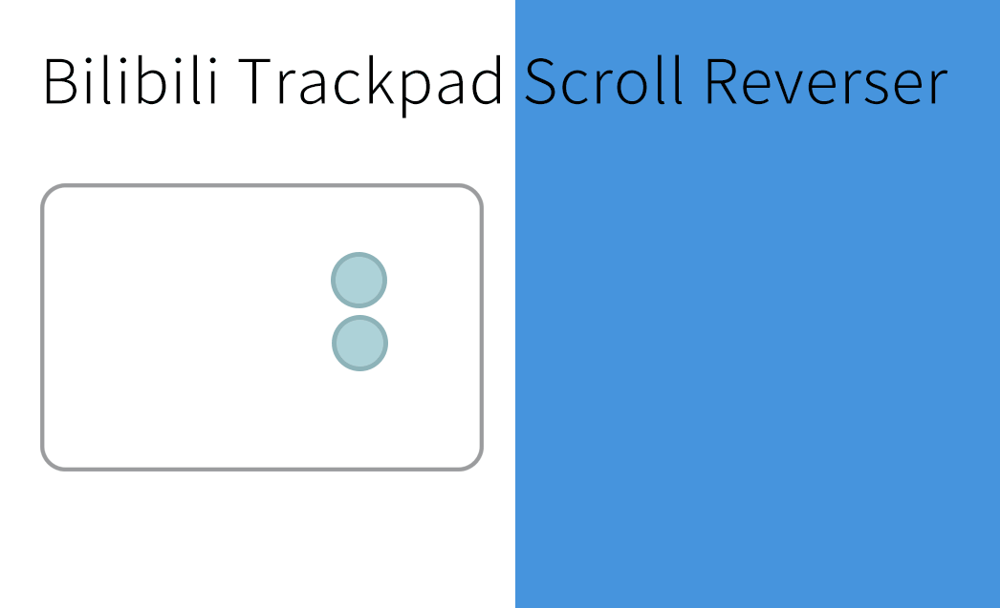

  

# 哔哩哔哩触控板滚动反转
# Bilibili-Trackpad-Scroll-Reverser

> 自然滚动下，音量的调节应该也是自然的。

优化 b 站视频音量调节在触控板上的体验。使用此脚本后，在 b 站视频全屏界面中，使用触控板向下滚动将减少音量。（未安装时为增大）

一般情况下，触控板的滚动语义是这样的：向上滚动时候，其意味着「展示下面的信息」。由于这种操作和现实的逻辑相同，也被称为自然滚动。而鼠标则是向上滚动则意味着「回到上方的信息」*。因此同一个方向的操作下，就得到了不同的结果。

然而，在音量调节的时候二者的语义则得到了统一：「向上就是升高，向下就是降低」。

由此则需要判断是否为触控板，再对其进行不同的处理。不过由于目前浏览器的 API 所限，目前仍然没有可以完美区别触控板和鼠标的方式。

 * macOS 默认情况下鼠标和触控板的「自然滚动」是统一设置的，但是对于许多非 Magic Mouse 用户仍会使用诸如 Scroll Reserver/鼠标自带驱动 之类的第三方工具来实现分别设置。

## 安装

[[Greasyfork](https://greasyfork.org/zh-CN/scripts/432783)]
[[Github Release](https://github.com/MaxChang3/Bilibili-Trackpad-Scroll-Reverser/releases/latest/download/bilibili-trackpad-scroll-reverser.user.js)]
[[Github Pages](https://maxchang3.github.io/Bilibili-Trackpad-Scroll-Reverser/bilibili-trackpad-scroll-reverser.user.js)]

## 建议

初始化时提供两个选项：「简单」与 「矫正」。

简单模式：粗暴地认为 `deltaY` 值低于 `100` 的为触控板。仅对于细微调节适用。移动过快时，会导致判断中间出错。

矫正模式：根据提示滚动鼠标滚轮选择最小整数 `deltaY`。 除去这个数值外，如果是浮点数则为鼠标，整数值则为触控板。

**对于 macOS（Chorme/Safari），推荐使用「矫正模式」。**

**对于未开启平滑滚动的情况下的 Windows 设备、所有平台的 Firefox 浏览器下，目前暂时推荐使用「简单模式」。** 

后续会在初始化流程自动引导该设置。

## 实现原理

Hook `EventTarget.prototype.addEventListener` 拦截对应的 `mousewheel` 事件。~~（为什么不用 `wheel`！）~~

判断是否为触控板，添加代理拦截 [wheelDelta](https://developer.mozilla.org/en-US/docs/Web/API/Element/mousewheel_event) 值，取相反数（这里直接取 [deltaY](https://developer.mozilla.org/en-US/docs/Web/API/WheelEvent/deltaY) 后做一定计算处理，他与 `wheelDelta` 正负相异）后返回。

## 触控板判断逻辑

> ⚠️ 由于硬件、浏览器差异，可能会有完全不同的表现，未作大范围测试，如有问题，欢迎反馈！

> 目前的逻辑是判断出鼠标，反过来得知触控板，鼠标测试硬件均为 Logitech MX Anywhere2s。

### macOS [1][2]

1.鼠标滚轮推动下的 `deltaY` 存在一个**最小整数值**，除去这个值之外的其他值大概率为浮点数，并且小数点后较为复杂。形如：`235.867919921875`。

2.触控板大部分情况下为整数，存在为浮点数的触控板，但是一般也不会很复杂。形如：`2.5`。

因此，采取人工矫正的方式，使用鼠标的最低刻度推动获取一个最低的整数 `deltaY`。除去这个值外的所有数值，都根据是否为整数[3]进行判断，是则为触控板，否则为鼠标。目前经过一段时间测试，效果良好。

### Windows[4]

1.未开启平滑滚动的情况下。通过不同的力度，仅能得到几个整数值。最低为 100。高至 600.

2.开启平滑滚动的情况下，数值为分布在 1 左右的浮点数。

因此，对于 Windows 目前推荐使用简单模式。

[1] 仅 Chrome / Safari，Firefox 下全部为整数值。

[2] 仅有限测试于 macOS 13.2.1（MacBook Air M1） 

[3] 由于 2 的原因，对 `deltaY` 做乘 2 处理避免这种情况。目前测试设备有限，未来可能会有所变动。

[4] 仅有限测试于 Windows 11（LEGION R7000）

## 更新日志

### 2.0
2023年3月10日
- 移植到 TypeScript
- 使用 [vite-plugin-monkey](https://github.com/lisonge/vite-plugin-monkey) 进行工程化开发
- 直接 Hook 事件监听，无需手工添加元素
- 使用 Proxy 重构
- 修改全屏判断逻辑

2.0 前更新日志

### 1.0	
2022年8月27日	
- 整理代码

### 0.8	
2022年8月27日	
- 重构大部分代码，适配新版播放页

### 0.7
2021年9月23日	
- 修改全屏判断

### 0.6	
2021年9月23日	

- 优化判断 
- 全屏下进行接管

### 0.5	
2021年9月23日	

- 支持番剧页面 
- 优化部分代码

#### 0.1 - 0.4	
2021年9月22日 - 2021年9月23日 

- 项目基本功能和完善

